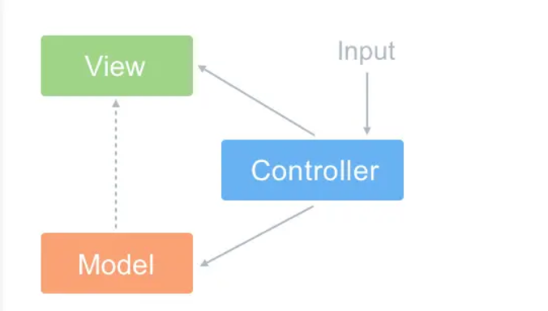
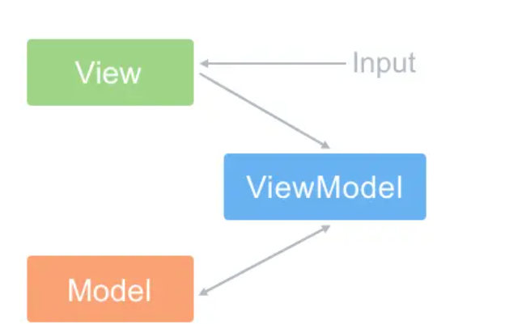

##  1.MVC和MVVM区别

### MVC
    MVC 全名是 Model View Controller，是模型(model)－视图(view)－控制器(controller)的缩写，一种软件设计典范

-  Model（模型）：是应用程序中用于处理应用程序数据逻辑的部分。通常模型对象负责在数据库中存取数据
- View（视图）：是应用程序中处理数据显示的部分。通常视图是依据模型数据创建的
- Controller（控制器）：是应用程序中处理用户交互的部分。通常控制器负责从视图读取数据，控制用户输入，并向模型发送数据
- MVC 的思想：一句话描述就是 Controller 负责将 Model 的数据用 View 显示出来，换句话说就是在 Controller 里面把 Model 的数据赋值给 View。



### MVVM

 ##### MVVM 新增了 VM 类

- ViewModel 层：做了两件事达到了数据的双向绑定 一是将【模型】转化成【视图】，即将后端传递的数据转化成所看到的页面。实现的方式是：数据绑定。二是将【视图】转化成【模型】，即将所看到的页面转化成后端的数据。实现的方式是：DOM 事件监听。
- MVVM 与 MVC 最大的区别就是：它实现了 View 和 Model 的自动同步，也就是当 Model 的属性改变时，我们不用再自己手动操作 Dom 元素，来改变 View 的显示，而是改变属性后该属性对应 View 层显示会自动改变（对应Vue数据驱动的思想

- 整体看来，MVVM 比 MVC 精简很多，不仅简化了业务与界面的依赖，还解决了数据频繁更新的问题，不用再用选择器操作 DOM 元素。因为在 MVVM 中，View 不知道 Model 的存在，Model 和 ViewModel 也观察不到 View，这种低耦合模式提高代码的可重用性

- 注意： Vue 并没有完全遵循 MVVM 的思想 这一点官网自己也有说明
那么问题来了 为什么官方要说 Vue 没有完全遵循 MVVM 思想呢？

``` 严格的 MVVM 要求 View 不能和 Model 直接通信，而 Vue 提供了$refs 这个属性，让 Model 可以直接操作 View，违反了这一规定，所以说 Vue 没有完全遵循 MVVM。 ```

### 为什么 data 是一个函数

组件中的 data 写成一个函数，数据以函数返回值形式定义，这样每复用一次组件，就会返回一份新的 data，类似于给每个组件实例创建一个私有的数据空间，让各个组件实例维护各自的数据。而单纯的写成对象形式，就使得所有组件实例共用了一份 data，就会造成一个变了全都会变的结果


### Vue 组件通讯有哪几种方式
- props 和$emit 父组件向子组件传递数据是通过 prop 传递的，子组件传递数据给父组件是通过$emit 触发事件来做到的
- $parent,$children 获取当前组件的父组件和当前组件的子组件
- $attrs 和$listeners A->B->C。Vue 2.4 开始提供了$attrs 和$listeners 来解决这个问题
- 父组件中通过 provide 来提供变量，然后在子组件中通过 inject 来注入变量。(官方不推荐在实际业务中使用，但是写组件库时很常用)
- $refs 获取组件实例
- eventBus 兄弟组件数据传递 这种情况下可以使用事件总线的方式
- vuex 状态管理