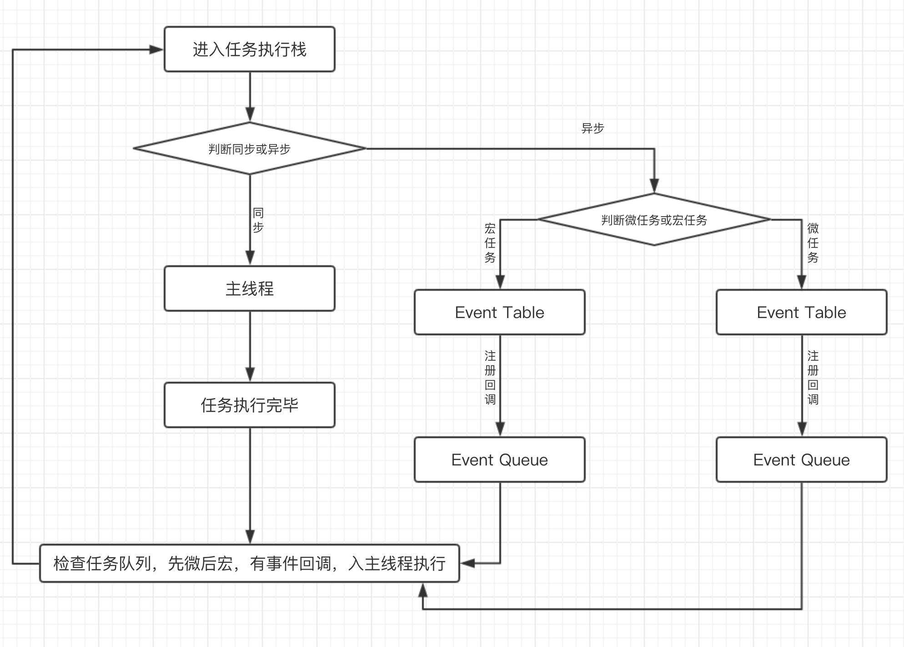

# 任务 微任务 队列 

#### 微任务 宏任务

在js中，任务可以分为同步任务和异步任务，也可以分为微任务和宏任务。同步任务属于宏任务，有了这些划分，就可以保证所有任务都有条不紊的执行下去，总的来说就是给要执行的任务定了执行规则、划分了优先级。

在总结宏任务与微任务时，我们先要知道我们哪些情况下可能会执行异步操作（未来某个时间执行任务）；然后要知道宏任务与微任务是怎么区分的，哪些属于宏任务，哪些属于微任务；最后我们要知道宏任务与微任务是通过什么规则来配合执行的。

- 能存在异步执行的情况
  - 回调函数 callback
  - Promise/async await
  - Generator 函数
  - 事件监听
  - 发布/订阅
  - 计时器
  - requestAnimationFrame
  - MutationObserver
  - process.nextTick
  - I/O

- 宏任务
  - 所有的同步任务
  - I/O, 比如文件读写、数据库数据读写等等
  - [window.setTimeout](https://developer.mozilla.org/zh-CN/docs/Web/API/Window/setTimeout)
  - [window.setInterval](https://developer.mozilla.org/zh-CN/docs/Web/API/Window/setInterval)
  - [window.setImmediate](https://developer.mozilla.org/zh-CN/docs/Web/API/Window/setImmediate)
  - [window.requestAnimationFrame](https://developer.mozilla.org/zh-CN/docs/Web/API/window/requestAnimationFrame)

- 微任务
  - [Promise.then catch finally](https://developer.mozilla.org/zh-CN/docs/Web/JavaScript/Reference/Global_Objects/Promise)
  - [Generator 函数](https://developer.mozilla.org/zh-CN/docs/Web/JavaScript/Reference/Global_Objects/Generator)
  - [async await](https://es6.ruanyifeng.com/#docs/async) 和promise是一样的，属于微任务
  - [MutationObserver](https://developer.mozilla.org/zh-CN/docs/Web/API/MutationObserver)

- 注
  - [process.nextTick](http://nodejs.cn/api/process.html#process_process_nexttick_callback_args)(它指定的任务总是发生在所有异步任务之前)，网上几乎无一例外说这是微任务，可是只要存在这个，process.nextTick就会在所有异步任务执行之前执行
  - 事件监听, 比如addeventlistener。宏任务待验证
  - 发布/订阅 宏任务待验证
  - 有人说同步任务属于宏任务，关于这中说法我觉得不太准确，应该说同步任务的执行优先级是高于异步任务

- 任务执行过程
  1. 所有任务都在主进程上执行，异步任务会经历2个阶段 Event Table和Event Queue
  2. 同步任务在主进程排队执行，异步任务（包括宏任务和微任务）在事件队列排队等待进入主进程执行
  3. 遇到宏任务推进宏任务队列，遇到微任务推进微任务队列（宏任务队列的项一般对应一个微任务队列，有点像一个大哥带着一群小马仔，这就组成一组异步任务。如果有嵌套那就会有多个大哥小马仔）
  4. 执行宏任务，执行完宏任务，检查有没有当前层的微任务（大哥带着小马仔逐步亮相。。。）
  5. 继续执行下一个宏任务，然后执行对应层次的微任务，直到全部执行完毕（下一个大哥带着他的小马仔亮相。。。）

